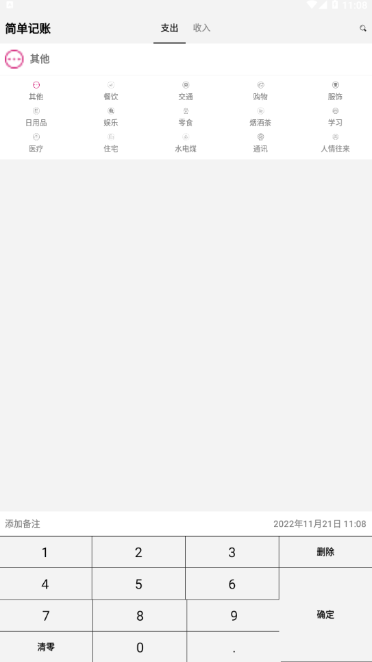
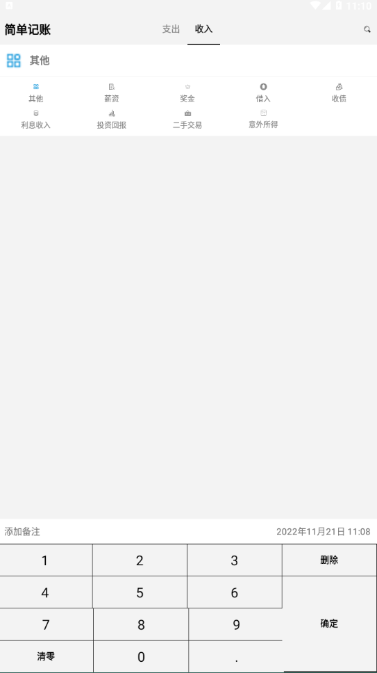
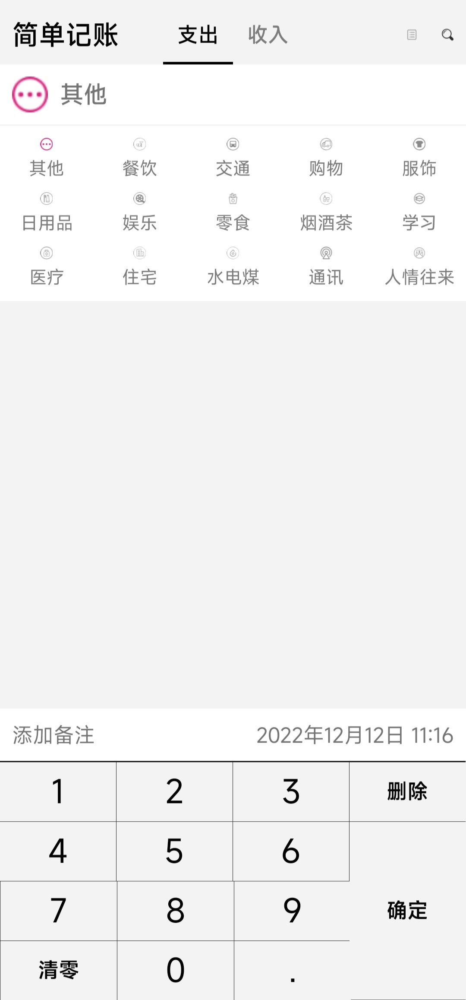
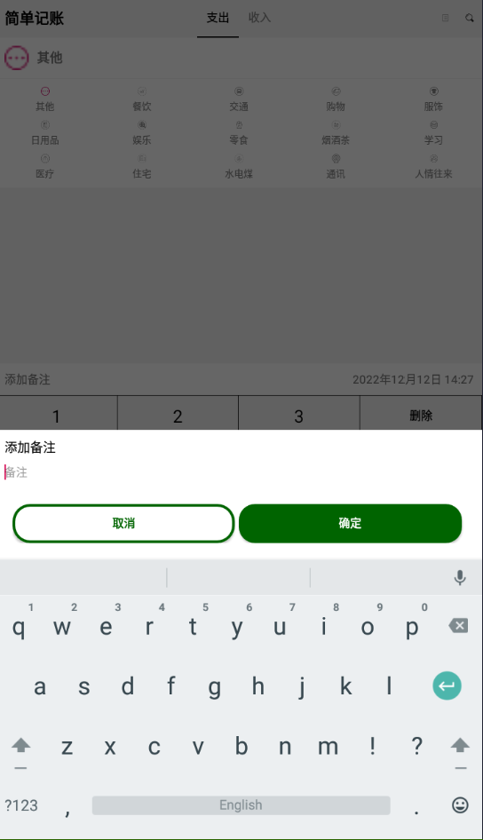
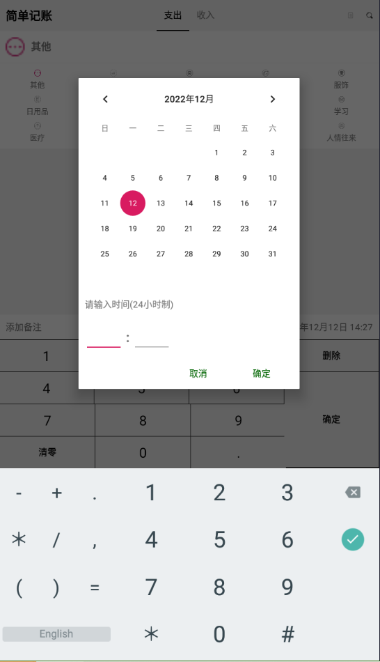
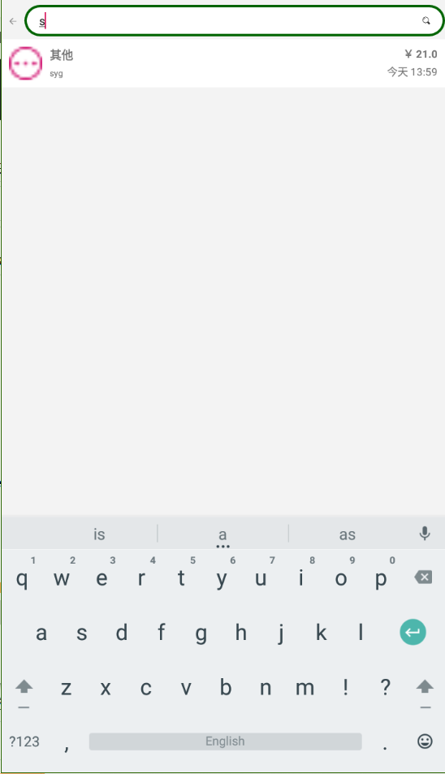
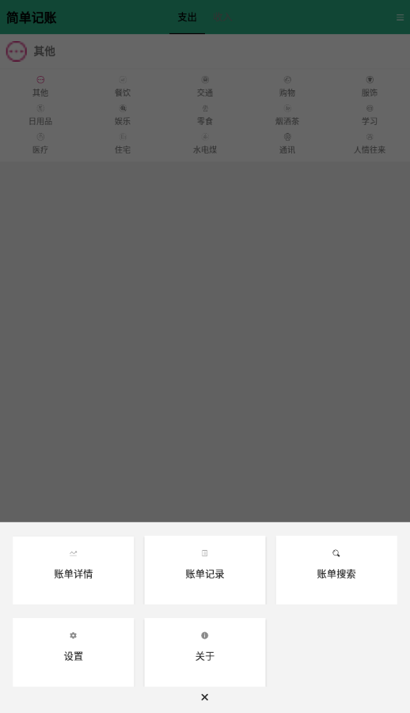
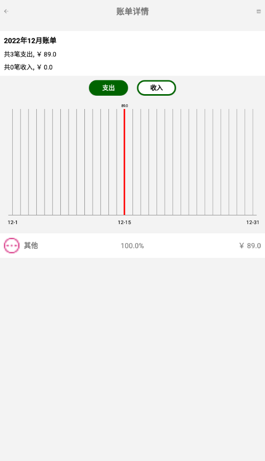

# 简单记账

持续开发中……

大三上数据库实验大作业

根据教程[1-简约记账app的介绍_哔哩哔哩_bilibili](https://www.bilibili.com/video/BV1Ey4y1k73N?p=1)来开发，加入自己对软件功能的想法。

## 开发过程

### step 0

完成初始界面绘制

|                    支出界面                    |                    收入界面                    |
| :--------------------------------------------: | :--------------------------------------------: |
|  |  |

### step 1

完成历史账单记录功能，入口在界面右上角账单图标。

|                 主界面入口                 |               账单记录界面展示               |
| :----------------------------------------: | :------------------------------------------: |
|  |  |

### step 2

记账添加备注和修改时间功能，主界面右上角搜索功能完成。

|                 添加备注                 |               更改时间               | 搜索功能                             |
| :--------------------------------------: | :----------------------------------: | ------------------------------------ |
|  |  |  |

### step 3

1. 修改主界面标题栏颜色（之后可以考虑在设置中增加主题颜色个性化选项）
2. 主界面右上角图标合并为 `更多` 一个按钮
3. 以一种极其离谱的方式修复了软键盘后两行不对齐的问题（是因为确定键横跨三行导致的不对齐现象，现在看似是一个确定键，实则有三个，不过对于用户来说是透明的）
4. 完成账单详情界面
5. 完成关于界面
6. 完成设置界面

|                主界面入口                |                 更多界面                 | 账单详情界面                             |
| :--------------------------------------: | :--------------------------------------: | -------------------------------------------- |
|    |  |  |
|               **关于界面**               |                 **设置界面**                 |                                              |
|  |  |                                              |

### todo

1. 更改分类的数据库内容
2. 更改分类的图标
