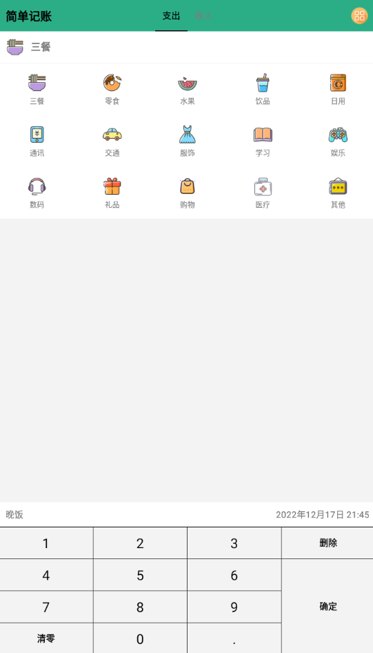
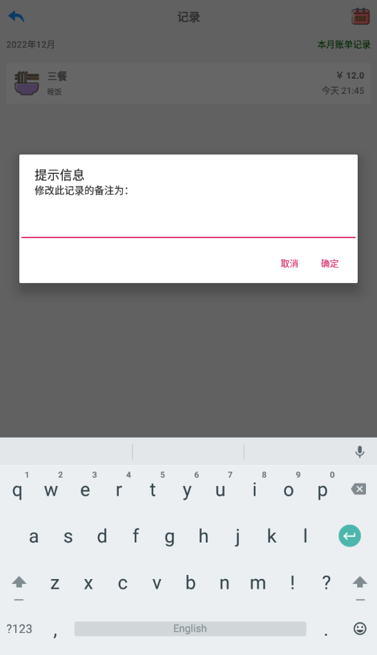
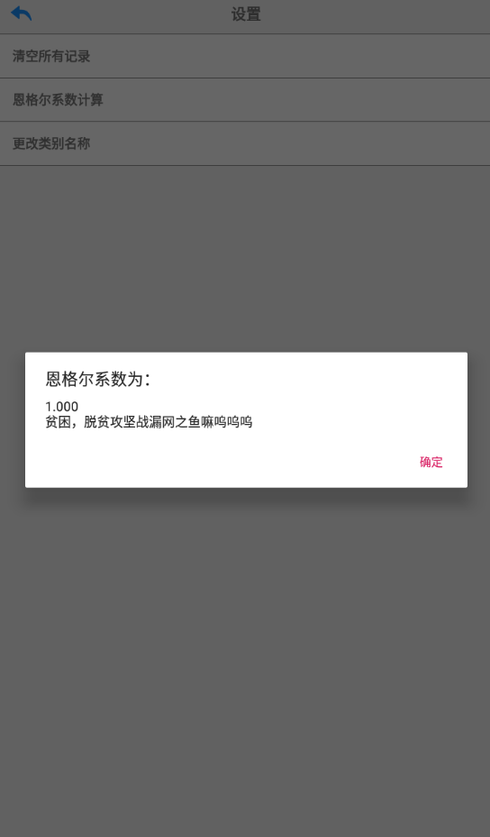
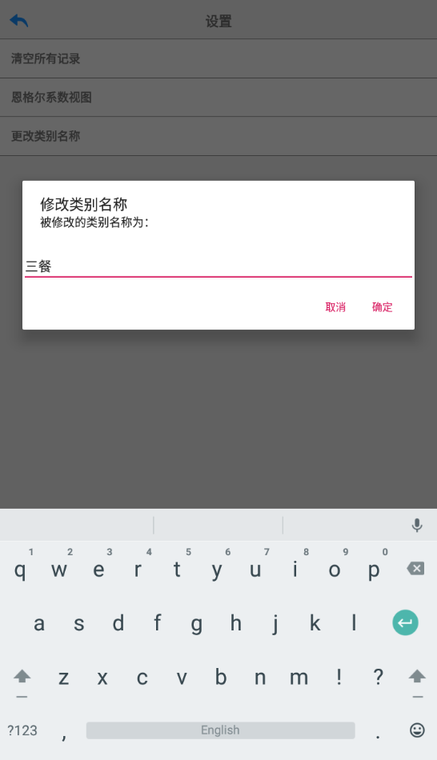
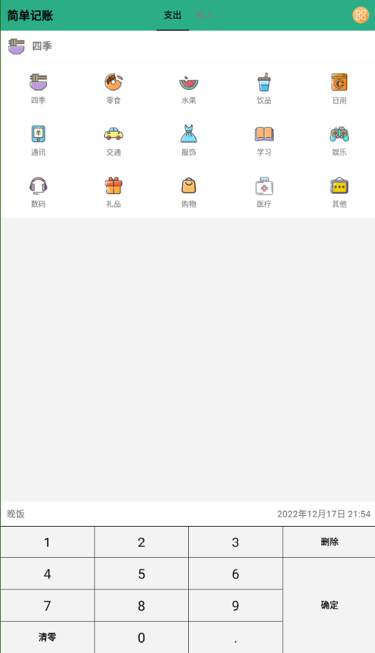
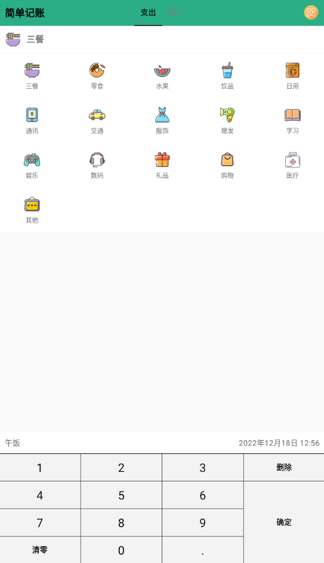

# 简单记账

大三上数据库实验大作业

根据教程[1-简约记账app的介绍_哔哩哔哩_bilibili](https://www.bilibili.com/video/BV1Ey4y1k73N?p=1)来开发，加入自己对软件功能的想法。

## 使用软件

无需配置数据库等，直接手机下载安装可执行程序中的`apk`安装包即可。

### 常见问题

> **问：为什么记账点击确定后直接退出了，是软件有bug闪退吗？**
>
> 答：软件设计就是记账点击确定会直接退出软件，不是软件有bug闪退了。是开发者结合自身记账使用情况得出90%以上情况是只需要记一笔然后退出软件，干脆点击确定后直接退出软件，而不是跳到其他并不需要的界面。
>
> 追问：那我想要记好多笔怎么办？
>
> 追答：点击图标重新进入软件再记。这听起来确实很麻烦，但是这种情况很少发生。这里有利用类似哈夫曼编码的思想，尽力优化大概率出现的事件，小概率出现的事件会变的比较麻烦，但是整体效率是最优的。相信我，深度使用以后你会爱上这样的设计的。

> **问：我记的账都去哪儿了，怎么找不到。**
>
> 答：点击首页右上角更多图标，在弹出的窗口选择记录，这里会以月视图的模式展示记账记录，右上角日历图标点击后可以选择查看的年份和月份。

> **问：如何删除一条记账记录？**
>
> 答：在记录界面长按需要删除的记录，会弹出对话框，点击确定即可删除。

> **问：如何修改记录的金额等属性？**
>
> 答：目前版本还不支持修改，可以删除重新创建。因为开发者尚未找到可以优雅地更改记录所有属性的方法，（其实是想法有了目前不会实现），不过更改这个功能并不是必须的，实践来看发生的情况甚至不到百分之一，所以当真的遇到需要修改的时候，烦请删除再次创建。

如遇其他问题请联系开发者，邮箱：781213930@qq.com

## 开发过程

### step 0

完成初始界面绘制

|                    支出界面                    |                    收入界面                    |
| :--------------------------------------------: | :--------------------------------------------: |
|  |  |

### step 1

完成历史账单记录功能，入口在界面右上角账单图标。

|                 主界面入口                 |               账单记录界面展示               |
| :----------------------------------------: | :------------------------------------------: |
|  |  |

### step 2

记账添加备注和修改时间功能，主界面右上角搜索功能完成。

|                 添加备注                 |               更改时间               | 搜索功能                             |
| :--------------------------------------: | :----------------------------------: | ------------------------------------ |
|  |  |  |

### step 3

1. 修改主界面标题栏颜色（之后可以考虑在设置中增加主题颜色个性化选项）
2. 主界面右上角图标合并为 `更多` 一个按钮
3. 以一种极其离谱的方式修复了软键盘后两行不对齐的问题（是因为确定键横跨三行导致的不对齐现象，现在看似是一个确定键，实则有三个，不过对于用户来说是透明的）
4. 完成账单详情界面
5. 完成关于界面
6. 完成设置界面

|                主界面入口                |                 更多界面                 |                 账单详情界面                 |
| :--------------------------------------: | :--------------------------------------: | :------------------------------------------: |
|    |  |  |
|               **关于界面**               |               **设置界面**               |                                              |
|  |  |                                              |

### step 4

1. 更改了数据库的表结构，将`typetb` 的 `sImageId`属性删去。
2. 更改分类
3. 更改图标为彩色图标

图标来源：主要来源[iconfont-阿里巴巴矢量图标库](https://www.iconfont.cn/collections/detail?spm=a313x.7781069.1998910419.d9df05512&cid=42149)，和此作者的其余多彩系列，个别来源于同网站其他作者

|                 主界面支出图标                 |                 主界面收入图标                 |
| :--------------------------------------------: | :--------------------------------------------: |
|  |  |

### step 5

1. 美化软件界面按钮图标
2. 更多菜单统一命名为两个字的
3. 美化软件图标

|                            主界面                            |                     主界面点击右上角更多                     |
| :----------------------------------------------------------: | :----------------------------------------------------------: |
|          |                |
|        **账单详情（记录界面相同）日历与返回图标更改**        |                     **搜索界面图标更改**                     |
|  |  |

软件图标更改为如下：

### step 6

1. 添加在固定时间指定备注的功能。目前为`11点之前`默认早饭，`11\~16点`午饭，`16\~24点`晚饭。
2. 添加恩格尔系数计算功能。根据定义，这里选取的生存性的食物只有三餐。很多有趣的提示语等待发现哦
3. 记录界面可以修改备注。在记录界面点击要修改的记录，直接输入新的备注内容即可。
4. 实现更改类别名称功能。输入待修改的名称，再输入新的名称。修改通过触发器实现级联更新，已经存在的记账条目中匹配的类别名称也会被修改。

|               主界面增加根据时间填备注               |               设置界面添加两个新功能               |               记录界面可修改备注               |
| :--------------------------------------------------: | :------------------------------------------------: | :--------------------------------------------: |
|  |  |  |
|                  **恩格尔系数计算**                  |                  **更改类别名称**                  |            **更改类别后首界面展示**            |
|            |            |    |

### step 7

1. 补充支出里的理发分类（之前找好图标忘了加
2. 修复更改名称不存在时不报错的`bug`
3. 优化代码规范，只优化了`android`中部分容易修改的规范

|               主界面添加理发分类               |              更改名称不存在时提示              |
| :--------------------------------------------: | :--------------------------------------------: |
|  |  |

### step 8

之前忘了写这一步的说明，补上。（因为这一步真的没有什么好说的

代码更加规范，全面规范了代码结构和组织，`warning`少了很多。

功能基本没有改动

### step 9

1. 删除点击可以修改备注的功能。

因为老实讲之前加这个功能是为了应对软件实现的过程中没有改这个操作，不符合老师说的必须包含增删改查的要求。现在在更改类别功能中已经实现了改这个操作，更重要的是，长按弹出删除框有时会弹出来修改备注的框，点击和长按事件均会触发，这个是不能忍受的，故要将修改备注的功能删除。之后会寻找优雅的办法实现附带信息跳转到记账的界面，这样支持对所有属性做出修改，这个是目前市面上大多数记账软件的做法，可惜开发者目前还不会实现，我会努力哒！

2. 在`accounttb`表创建`year month kind`组合索引。

这个是因为在大作业实验报告的要求中有一部分要介绍自己的物理设计如索引的实现，其实不创建索引也可以，分析没有必要创建索引的理由。不过在分析的过程中发现，其实也可以建一个组合索引的，对`year month kind`的组合查询多次出现。不过的不过，由于表中数据并不多，创建索引的影响并不会很大，后续可能考虑删除。

### todo

实验报告可以推迟两天交啦

1. 继续完善报告源代码讲解部分
2. 录制演示视频
3. 制作宣传视频
4. 添加修改记录所有属性的功能
5. 备份功能
6. 添加周期性定时记账功能
