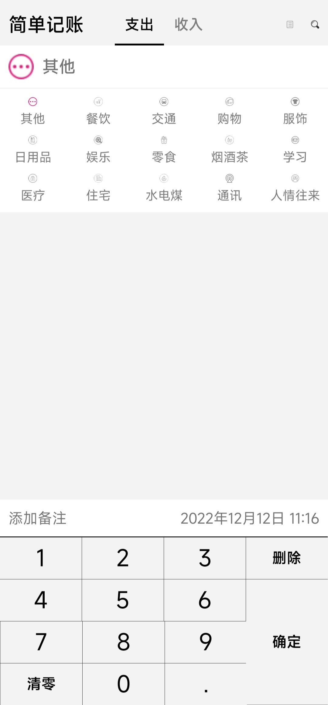

# 简单记账

持续开发中……

大三上数据库实验大作业

根据教程[1-简约记账app的介绍_哔哩哔哩_bilibili](https://www.bilibili.com/video/BV1Ey4y1k73N?p=1)来开发，加入自己对软件功能的想法。

## 开发过程

### step 0

完成初始界面绘制

|                支出界面                |                收入界面                 |
| :------------------------------------: | :-------------------------------------: |
|  |  |

### step 1

完成历史账单记录功能，入口在界面右上角账单图标。

|                 主界面入口                 |             账单记录界面展示              |
| :----------------------------------------: | :---------------------------------------: |
|  |  |

### step 2

记账添加备注和修改时间功能，主界面右上角搜索功能完成。

|                 添加备注                 |               更改时间                | 搜索功能                              |
| :--------------------------------------: | :-----------------------------------: | ------------------------------------- |
|  |  |  |

### todo

3. 视图统计功能
4. 关于作者