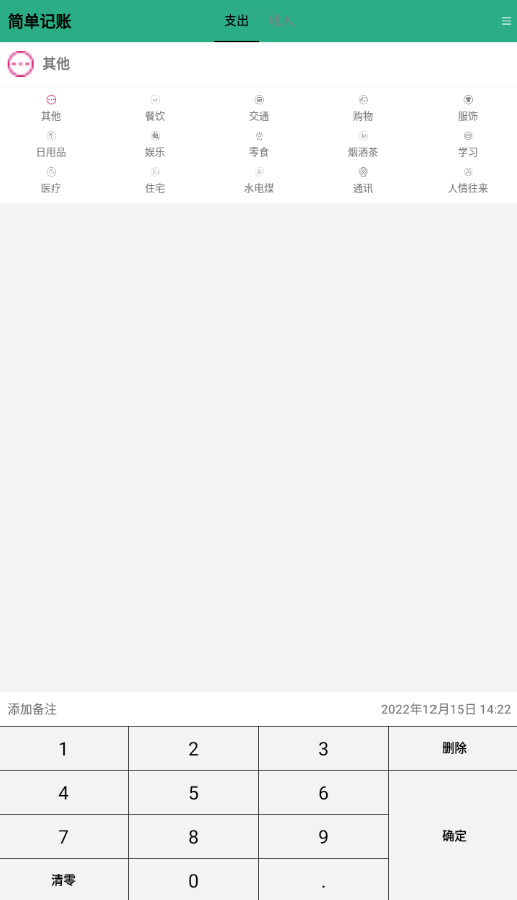

# 简单记账

持续开发中……

大三上数据库实验大作业

根据教程[1-简约记账app的介绍_哔哩哔哩_bilibili](https://www.bilibili.com/video/BV1Ey4y1k73N?p=1)来开发，加入自己对软件功能的想法。

## 使用软件

无需配置数据库等，直接手机下载安装可执行程序中的apk安装包即可。

### 常见问题

> 问：为什么记账点击确定后直接退出了，是软件有bug闪退吗？
>
> 答：软件设计就是记账点击确定会直接退出软件，不是软件有bug闪退了。是开发者结合自身记账使用情况得出90%以上情况是只需要记一笔然后退出软件，干脆点击确定后直接退出软件，而不是跳到其他并不需要的界面。
>
> 追问：那我想要记好多笔怎么办？
>
> 追答：点击图标重新进入软件再记。这听起来确实很麻烦，但是这种情况很少发生。这里有利用类似哈夫曼编码的思想，尽力优化大概率出现的事件，小概率出现的事件会变的比较麻烦，但是整体效率是最优的。相信我，深度使用以后你会爱上这样的设计的。

> 问：我记的账都去哪儿了，怎么找不到。
>
> 答：点击首页右上角更多图标，在弹出的窗口选择记录，这里会以月视图的模式展示记账记录，右上角日历图标点击后可以选择查看的年份和月份。

如遇其他问题请联系开发者，邮箱：781213930@qq.com

## 开发过程

### step 0

完成初始界面绘制

|                    支出界面                    |                    收入界面                    |
| :--------------------------------------------: | :--------------------------------------------: |
|  |  |

### step 1

完成历史账单记录功能，入口在界面右上角账单图标。

|                 主界面入口                 |               账单记录界面展示               |
| :----------------------------------------: | :------------------------------------------: |
|  |  |

### step 2

记账添加备注和修改时间功能，主界面右上角搜索功能完成。

|                 添加备注                 |               更改时间               | 搜索功能                             |
| :--------------------------------------: | :----------------------------------: | ------------------------------------ |
|  |  |  |

### step 3

1. 修改主界面标题栏颜色（之后可以考虑在设置中增加主题颜色个性化选项）
2. 主界面右上角图标合并为 `更多` 一个按钮
3. 以一种极其离谱的方式修复了软键盘后两行不对齐的问题（是因为确定键横跨三行导致的不对齐现象，现在看似是一个确定键，实则有三个，不过对于用户来说是透明的）
4. 完成账单详情界面
5. 完成关于界面
6. 完成设置界面

|                主界面入口                |                 更多界面                 |                 账单详情界面                 |
| :--------------------------------------: | :--------------------------------------: | :------------------------------------------: |
|    |  |  |
|               **关于界面**               |               **设置界面**               |                                              |
|  |  |                                              |

### step4

1. 更改了数据库的表结构，将`typetb` 的 `sImageId`属性删去。
2. 更改分类
3. 更改图标为彩色图标

图标来源：主要来源[iconfont-阿里巴巴矢量图标库](https://www.iconfont.cn/collections/detail?spm=a313x.7781069.1998910419.d9df05512&cid=42149)，和此作者的其余多彩系列，个别来源于同网站其他作者

|                 主界面支出图标                 |                 主界面收入图标                 |
| :--------------------------------------------: | :--------------------------------------------: |
|  |  |

### step5

1. 美化软件界面按钮图标
2. 更多菜单统一命名为两个字的
3. 美化软件图标

|                            主界面                            |                     主界面点击右上角更多                     |
| :----------------------------------------------------------: | :----------------------------------------------------------: |
|          |                |
|        **账单详情（记录界面相同）日历与返回图标更改**        |                     **搜索界面图标更改**                     |
|  |  |

软件图标更改为如下：

### todo

1. 尝试写一下大作业的报告，遇到问题有需要补充的再继续开发
2. 添加在固定时间指定备注的功能               √
3. 添加恩格尔系数视图
4. 添加定时记账功能
5. 备份功能
6. 在记录界面添加点击跳转到修改界面的功能